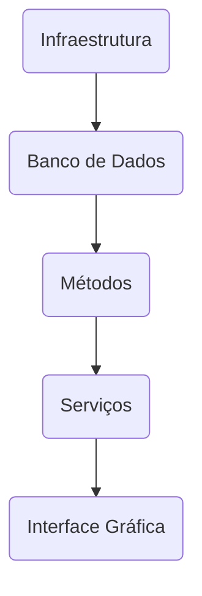

# A mentalidade de quem testa aplicações

Há diversas definições de quais são os comportamentos e forma de pensar de alguém que testa aplicações, elas baseiam-se basicamente em **explosão de curiosidade, criticismo e empatia com o cliente** que receberá a aplicação.

O principal objeto dos testes é a **antecipação de problema** que só seriam identificados pelos clientes!

Alguém que testa uma aplicação pode ter diferente clientes (KANER et al., 2008), por exemplo: o usuário, o desenvolvedor, o product owner, um sistema terceiro que utilizará sua API, etc

> **Dica de Leitura:** Lessons Learned in Software Testing: A Context-Driven Approach

## Características de quem testa

Há três características que **predominam na mentalidade** de quem testa:

 1. Curiosidade;
 2. Criticismo;
 3. Vontade de se colocar lugar do cliente.

|1  | 2 | 3 |
|--|--|--|
|Preciso validar que o produto **atenda às expectativas do meu cliente**.  |Tenho que **antecipar comportamentos inesperados** e alertar os riscos ao meu time.  |É minha missão **disseminar essa mentalidade** dentre meus amigos. |

## Comunicação
Uma **característica muito importante** também é a comunicação pois o dia a dia de quem testa é permeado por interações com o time, seja por **entender o produto que será criado**, para **comunicar suas atividades**, para **discutir uma possível inconsistência** no produto ou mesmo para **compartilhar algum conhecimento**.

Sua interação com o time deve ser colaborativa, buscando ajuda-los a aplicar testes e mostrando a eles os impactos de não testar.

Dicas para comunicar com seu time

 - Tenha precisão e assertividade ao comunicar riscos e inconsistências;
 - Não tenha medo ou receio de informar seus pensamentos e dúvidas;
 - Sejam maduros em dar e receber feedback.

## Colaborando sob a perspectivas de testes desde o início

Hoje no mercado atual é papel do tester participar de cada etapa desde a concepção e **influenciar as decisões sobre a perspectiva de testes**.

- **Na ideação**, revisando a viabilidade do produto;
- **Nos requisitos**, revisando sua consistência e boas práticas.;
- **No código**, revisando boas práticas e colaborando na escrita de testes.

## Testar todas as camadas que contemplam a aplicação

A identificação de o que testar pode ocorrer a partir de duas abordagens: **empírica ou sistemática**.

Na abordagem empírica, quem testa deve escolher o que testar **baseando-se em suas experiências** nesse ou em outros produtos semelhantes.

Já na abordagem sistemática, quem testa **baseia-se em técnicas de teste** em que, dado uma regra, identifica-se o que deve-se testar.

## Analise de riscos

Risco representa a possibilidade de benefício ou prejuízo. **Em testes, pensaremos na possibilidade de prejuízo**. Dito isso, entenda que uma das suas atividades deve ser **olhar para uma aplicação e tentar identificar como ele pode dar errado**. Então, mitiga-los com testes.

>Uma estratégia antes de iniciar os testes é sempre olhar para aplicação que devera ser testada e estabelecer quais são os fatores de riscos para esta aplicação e estabelecer estratégias que contemplam estes cenários.
 
## Exercícios
Perguntas
 1. A mentalidade de quem testa busca saber se o produto atende as expectativas do  cliente, se antecipou comportamentos inesperados e se conseguiu inspirar seus companheiros a testar de maneira apropriada!
 2. Quem testa tem apenas um cliente: O usuário!
 3. Ao identificar riscos, prefira lidar com ele sozinho sem reportar ao time, buscando não causar desconforto quanto a data de entrega.
 4. Só é possível colaborar com o time pela perspectiva de testes nas etapas finais de um projeto!
 5. Podemos mitigar riscos da aplicação através da execução de testes.
 6. Não é viável colaborar com o time na antecipação de atividades de teste para que não atrapalhe-os nas datas de entrega de suas aplicações.
 7. Quem testa precisa ajudar o time a aplicar testes em suas atividades.
 8. Testes devem ocorrer apenas em uma das camadas da aplicação: a interface gráfica.
 9. A escolha de o que testar dá-se apenas pela experiência de quem testa. Por isso, somente testadores experientes podem testar aplicações.

 Respostas

 1. Verdadeiro (estas são as três características básicas de quem testa uma aplicação).
 2. Falsa (são vários  tipos de clientes que temos).
 3. Falsa (Após encontrar os riscos deve ser exposto para todo o time de forma que juntos estabeleçam uma estratégia de como mitigar estes problemas).
 4. Falsa (O tester deve colaborar com o time durante toda etapa de analise e desenvolvimento).
 5. Verdadeiro (Uma vez que identificamos o risco estabelecemos os testes que serão executados).
 6. Falso (Devemos inspirar o nosso time desde o inicio para evitar problemas futuros).
 7. Verdadeiro (Devemos inspirar o nosso time desde o inicio para evitar problemas futuros).
 8. Falso (Os testes devem ocorrer em todas as camadas da aplicação).
 9. Falso (Utilizando a abordagem sistemática utilizamos técnicas que independem de experiências)

## Conclusão

-   O que eu aprendi de mais importante durante o estudo desse capítulo?
>Devemos ser **curioso**, imaginar todas as possibilidades que nossos mais diversos clientes utilizaram e tentarão utilizar nossa aplicação, ser **critico** e ajudar meu time a enxergar todos os pontos de impactos sobre tal funcionalidade e **disseminar** todas as técnicas de teste com meu time para que possamos e juntos garantir a qualidade esperado em cima de nossa aplicação.
-   O que posso usar imediatamente na empresa onde trabalho?
>Fazer o levantamento de risco em cima de cada funcionalidade e a ser testada, melhorar meu olhar critico e comunicar melhor com toda a equipe a fim de evitar ruídos e para que possamos entregar oque for de melhor para nossos clientes.
-   O que eu deveria se dedicar a fixar melhor?
> Entendimento de como fazer o levantamento do que testar a partir da abordagem Sistemática.
